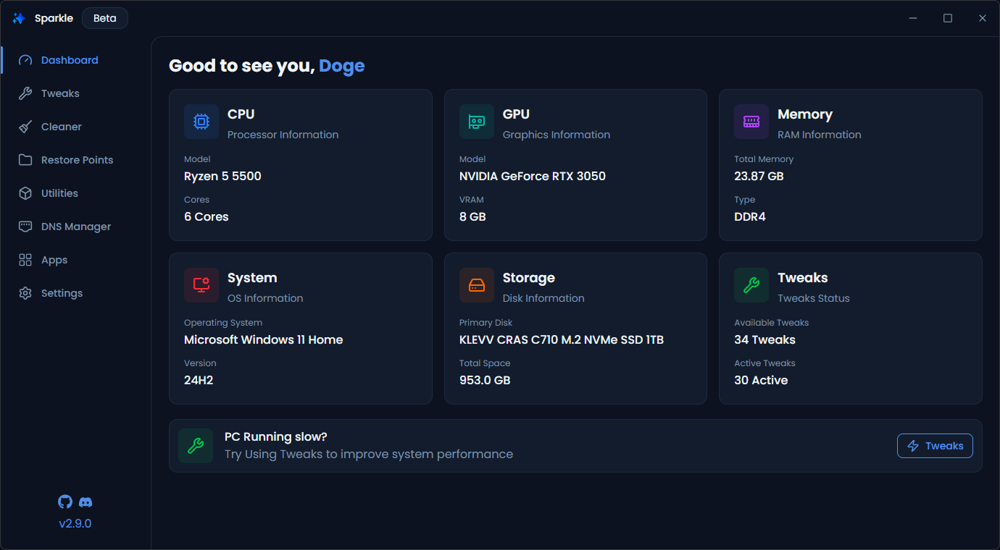

<div align="center">
  <a href="https://github.com/Parcoil/Sparkle">
    
  </a>

  <h3>Sparkle</h3>
  <p>A Windows app to debloat and optimize your PC</p>

  <p>
<picture><source media="(prefers-color-scheme: dark)" srcset="https://shieldcn.dev/badge/React.svg?variant=secondary&amp;logo=react&amp;mode=dark"></picture>
   <a href="#-what-if-im-allergic-to-electron"> <picture><source media="(prefers-color-scheme: dark)" srcset="https://shieldcn.dev/badge/Electron.svg?variant=secondary&amp;logo=electron&amp;mode=dark"></picture></a>
<picture><source media="(prefers-color-scheme: dark)" srcset="https://shieldcn.dev/badge/Typescript.svg?variant=secondary&amp;logo=typescript&amp;mode=dark"></picture>
<picture><source media="(prefers-color-scheme: dark)" srcset="https://shieldcn.dev/badge/Powershell.svg?variant=secondary&amp;logo=ri%3ATbBrandPowershell&amp;mode=dark"></picture>
<picture><source media="(prefers-color-scheme: dark)" srcset="https://www.shieldcn.dev/github/stars/parcoil/sparkle.svg?variant=secondary&amp;size=sm&amp;mode=dark"></picture>
  </p>

## Quick Start

Install with Powershell:

```powershell
irm https://raw.githubusercontent.com/Parcoil/Sparkle/v2/get.ps1 | iex
```

<a href="https://github.com/Parcoil/Sparkle/releases/latest">Download Installer/Portable</a>
<a href="https://sourceforge.net/projects/sparkle-debloater">Download From Sourceforge</a>

  <br/>
  <br/>

  

</div>
  
  > [!WARNING]
  > Sparkle is currently in beta. While we've tested it extensively, you may encounter some bugs. Please back up your system before applying tweaks and report any issues you find.

  <h3 align="left">Features</h3>

| Feature         | Description                                                                                                                                                                                                      |
| --------------- | ---------------------------------------------------------------------------------------------------------------------------------------------------------------------------------------------------------------- |
| Apply Tweaks    | 40 tweaks across 7 categories with reversible toggles, recommended presets, GPU compatibility detection, and a built-in debloater with 2 methods                                                                 |
| System Cleaner  | Clean 6 categories of junk files: temp files, prefetch, recycle bin, Windows Update cache, thumbnail cache, and error reports with per-category size detection                                                   |
| Utilities       | 15 system utilities including SFC, DISM, Check Disk, GPU driver restart, network reset, power plan manager, Storage Sense, and more                                                                              |
| DNS Manager     | Switch DNS with 5 preset providers, custom DNS, a "Find Fastest DNS" ping test, current DNS viewer, and cache flushing                                                                                           |
| App Installer   | Browse and batch install/uninstall 156 apps across 10 categories with <a href="https://learn.microsoft.com/en-us/windows/package-manager/winget/">Winget</a> or <a href="https://chocolatey.org/">Chocolatey</a> |
| Backup & Revert | Create and restore Windows restore points, plus undo individual or all applied tweaks via unapply scripts                                                                                                        |
| System Stats    | Dashboard showing CPU, GPU, RAM, OS version, disk info, and active tweak count                                                                                                                                   |

<h3>What is Sparkle?</h3>

The current state of Windows is rough. Broken updates, preinstalled junk, background services, and telemetry that run whether you want them or not.

Sparkle can't fix all of Windows problems, but it can help you debloat your PC, improve performance, and reduce latency.

<h3>Why Should I Optimize Windows?</h3>

A default Windows installation comes with pre installed apps you didn't ask for or that you will never use for such as telemetry running in the background and services eating up resources for features you'll never use.

Optimizing is about cutting that unnecessary overhead so more of your PC's resources gos to what actually matters such as gaming, rendering, or just a snappier desktop experience.

Everything Sparkle does can also be done manually, but that doesn't mean you should have to

# FAQ

### Is Sparkle safe to use?

Yes. Sparkle is fully open source with the GPL-V3 licence meaning anyone can view, edit or build the code themselves. Currently there is no CI/CD yet. If you perfer you can clone the repo and build Sparkle yourself read here: <a href="#building-sparkle">Building Sparkle</a>

### Does Sparkle impove performance?

Depends. Every tweak and utility has been tested on real hardware. None of the tweaks are AI-generated, blindly added, or untested. None of the tweaks are made up, and there are no fake registry values or anything like that. Performance improvements depend on your hardware any what you apply in Sparkle.

### Can i undo changes made by Sparkle?

Yes, all tweaks are reversible. You can either use Sparkle's tweak reverse or a system restore point.

### Why does Sparkle ask for admin permissions?

Admin permissions are required to apply system-level tweaks and optimizations and using/creating restore points.

### Why does Windows Defender/Smartscreen Block Sparkle

Sparkle is not currently signed since it costs a lot for an open source project. When you run an unsigned exe on Windows it automatically assumes it's unsafe and blocks it.

You can get around it by:

Click "More info" → "Run anyway".

<div>
  <h2>📃 Docs</h2>
  <p>You can find the docs <a href="https://docs.getsparkle.net">here</a></p>
  The docs cover all the tweaks, how they work what they do and all of Sparkle's Pages and tools.
</div>

<div>
  <h3>💖 Credits</h3>
  <ul>
    <li>
      <a href="https://github.com/ChrisTitusTech/winutil">CTT's WinUtil (Some of the tweaks & <b>Part</b> of the inspo for making this v2 of this project)</a>
    </li>
    <li>
      <a href="https://github.com/Raphire/Win11Debloat">Raphire Win11Debloat ( Secondary Debloat script offered in Sparkle debloat script)</a>
    </li>
  </ul>

  <h3>👥 Contributing</h3>

  <h4>Adding New Tweaks</h4>
  <ul>
    <li>Tweaks are located in <code>/tweaks</code></li>
  </ul>

Refer to the <a href="https://docs.getsparkle.net">docs</a> for more info on how to add new tweaks

  <h4>Other Ways to Contribute</h4>
  <ul>
    <li>🐛 Report bugs and issues</li>
    <li>💡 Suggest new features or improvements</li>
    <li>📝 Improve documentation</li>
    <li>🎨 Enhance the UI/UX</li>
    <li>🧪 Improve code quality</li>
  </ul>

  <details>
  <summary><h3>What if I’m allergic to Electron?</h3></summary>

That’s totally fine, this project probably isn’t for you.  
 You might want to check out [CTT WinUtil](https://github.com/ChrisTitusTech/winutil),  
 A PowerShell based alternative that keeps things nice and lightweight.

this message is inspired by [this](https://github.com/nukeop/nuclear/blob/legacy/electron/docs/electron.md)

</details>

<h2>Building Sparkle</h4>

<p>To build sparkle you will need the following</p>
<ul>
  <li><b>Node.js</b> v22 or higher (v24 recommended)</li>
  <li><b>pnpm</b></li>
  <li><b>Windows 10/11</b></li>
</ul>

---

</div>

> [!IMPORTANT]
> The version of sparkle in the repo is most likely newer than the latest release. expect bugs and unreleased features

<ol>
  <li>
    <b>Clone the repository:</b>
    <pre><code>git clone https://github.com/Parcoil/Sparkle
cd Sparkle</code></pre>
  </li>
  <li>
    <b>Install dependencies:</b>
    <pre><code>pnpm i</code></pre>
  </li>
  <li>
    <b>Start the app in development mode:</b>
    <pre><code>pnpm dev</code></pre>
    <i>This will launch Sparkle with hot reload for both the Electron main and renderer processes.</i>
  </li>
  <br/>
  <li>
    <b>Build for production:</b>
    <pre><code>pnpm build</code></pre>
    <i>This will compile Sparkle, Builds are located in <code>dist/</code> folder. you may be prompted if you want to update the tweak registry. This is only for production builds</i>
  </li>
</ol>
 <br/>
  <p align="center">Made with ❤️ by Parcoil</p>

## Star History

<a href="https://www.star-history.com/#Parcoil/Sparkle&Date">
 <picture>
   <source media="(prefers-color-scheme: dark)" srcset="https://api.star-history.com/svg?repos=Parcoil/Sparkle&type=Date&theme=dark" />
   <source media="(prefers-color-scheme: light)" srcset="https://api.star-history.com/svg?repos=Parcoil/Sparkle&type=Date" />
   
 </picture>
</a>
