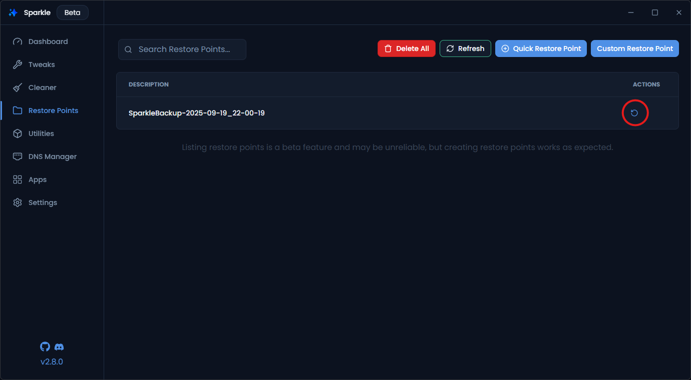

# Uninstalling Sparkle

## Restore Points (Optional)
If you would like to restore your system to a point before you used tweaks inside of Sparkle, you can use a restore point either one created by Sparkle or one you created yourself, whether it’s in Sparkle or in Windows.

<!--  -->

## Step 1: Revert Tweaks

 if you want to restore your pc to its state before using sparkle:

 1. Open **Sparkle**
 2. Navigate to the **Tweaks** page.
 3. Unapply All Tweaks you dont want anymore.
 5. Restart Your PC.

## Step 2: Uninstalling Sparkle

1. **Close Sparkle**: Make sure sparkle is not running at all on your system. be sure to check the tray

2. **Uninstall the App**: Go to `Settings > Apps > Installed Apps`, or click [Here](ms-settings:appsfeatures) locate Sparkle, and choose **Uninstall**.
  
## Advanced Method

If you want to completely remove Sparkle from your system without leaving any leftover files, you can use **BCUninstaller**.  
It can be installed via **Sparkle**, Winget, or directly from the [official release page](https://github.com/Klocman/Bulk-Crap-Uninstaller/releases/latest).
